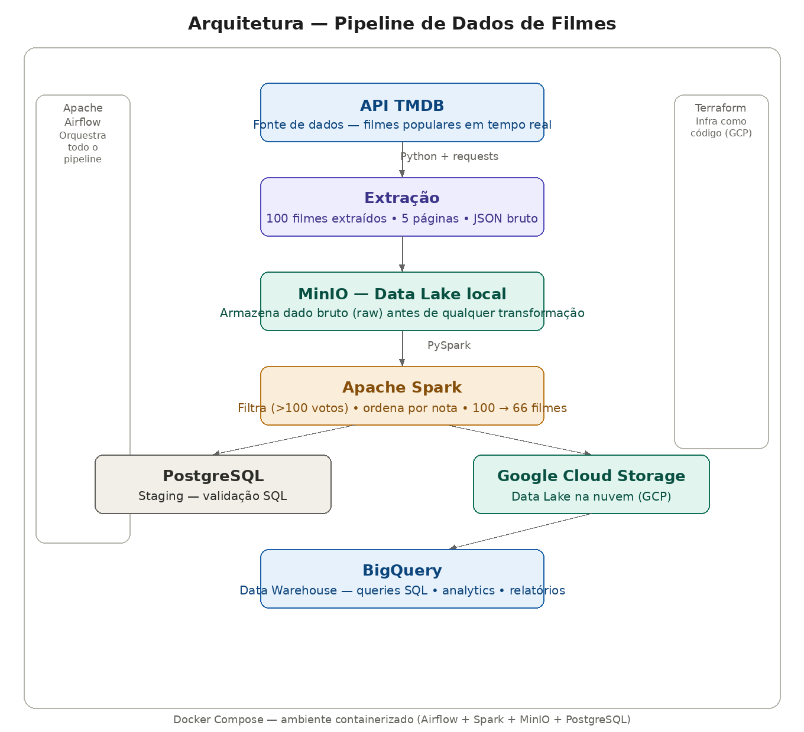

# Pipeline de Dados de Filmes — End to End

Pipeline de dados completo construído para aprendizado prático de Engenharia de Dados, consumindo dados da API do TMDB e processando até o BigQuery no GCP.

## Arquitetura



O pipeline segue o fluxo clássico de engenharia de dados em camadas:

**Ingestão:** Python consome a API do TMDB e extrai 100 filmes populares em formato JSON bruto.

**Data Lake local:** O dado bruto é armazenado no MinIO antes de qualquer transformação — garantindo que o dado original nunca seja perdido e possa ser reprocessado a qualquer momento.

**Transformação:** Apache Spark lê o dado bruto, filtra filmes com menos de 100 votos (critério de qualidade), ordena por nota e reduz de 100 para 66 filmes processados.

**Staging:** Os dados processados são carregados no PostgreSQL para validação via SQL antes de seguir para a nuvem.

**Data Lake na nuvem:** O arquivo processado é enviado para o Google Cloud Storage, servindo como camada de persistência na nuvem.

**Data Warehouse:** Os dados chegam ao BigQuery onde ficam disponíveis para queries SQL e analytics.

**Orquestração:** Apache Airflow agenda e monitora todo o pipeline diariamente às 8h, garantindo que cada etapa rode na ordem correta e com retentativas em caso de falha.

**Infraestrutura como código:** Toda a infraestrutura no GCP (bucket GCS + datasets BigQuery) é provisionada via Terraform — qualquer pessoa consegue recriar o ambiente com um único comando.

**Ambiente containerizado:** Airflow, Spark, MinIO e PostgreSQL rodam em Docker Compose, garantindo reprodutibilidade total do ambiente local.

## Tecnologias

| Tecnologia | Função |
|---|---|
| Python | Extração e scripts de ingestão |
| Apache Airflow | Orquestração do pipeline |
| Apache Spark (PySpark) | Transformação e processamento |
| MinIO | Data Lake local (S3 compatível) |
| PostgreSQL | Camada de staging |
| Google Cloud Storage | Data Lake na nuvem |
| BigQuery | Data Warehouse analytics |
| Terraform | Infraestrutura como código |
| Docker + Compose | Containerização do ambiente |
| GitHub Codespaces | Ambiente de desenvolvimento cloud |

## Decisões técnicas

**Por que MinIO antes do GCS?** O dado bruto sempre é persistido localmente antes de ir para a nuvem. Se algo falhar no processamento, o dado original está disponível para reprocessamento sem precisar chamar a API novamente.

**Por que Spark e não Pandas?** O Spark foi escolhido para simular um ambiente real de produção onde o volume de dados pode ser muito maior. A lógica de transformação é a mesma, mas a ferramenta escala para bilhões de linhas.

**Por que dois datasets no BigQuery (staging e analytics)?** Separar as camadas garante que dados não validados nunca cheguem diretamente ao destino final — padrão usado em times de dados de produção.

**Por que Terraform?** Infraestrutura como código garante que qualquer pessoa do time consiga recriar o ambiente exato com um único comando, eliminando o problema de "funciona na minha máquina".

## Resultado analítico

Top 5 filmes por nota no BigQuery após o pipeline:

| Filme | Nota | Ano |
|---|---|---|
| Um Sonho de Liberdade | 8.719 | 1994 |
| O Poderoso Chefão | 8.686 | 1972 |
| Pulp Fiction | 8.484 | 1994 |
| Interestelar | 8.471 | 2014 |
| Vingadores: Guerra Infinita | 8.234 | 2018 |

Queries disponíveis no BigQuery:

```sql
-- Top 10 filmes por nota
SELECT title, rating, release_date
FROM `pipeline-filmes.analytics.movies`
ORDER BY rating DESC
LIMIT 10;

-- Filmes mais populares por idioma
SELECT original_language, COUNT(*) as total, ROUND(AVG(rating), 2) as avg_rating
FROM `pipeline-filmes.analytics.movies`
GROUP BY original_language
ORDER BY total DESC;

-- Distribuição de notas
SELECT
  CASE
    WHEN rating >= 8 THEN 'Excelente (8+)'
    WHEN rating >= 7 THEN 'Bom (7-8)'
    ELSE 'Regular (<7)'
  END as categoria,
  COUNT(*) as total
FROM `pipeline-filmes.analytics.movies`
GROUP BY categoria;
```

## Como rodar

### Pré-requisitos
- GitHub Codespaces ou Docker instalado
- Conta GCP com projeto criado
- API Key do TMDB

### 1. Subir o ambiente
```bash
cd docker
docker compose up airflow-init
docker compose up -d
```

### 2. Criar infraestrutura GCP
```bash
cd terraform
terraform init
terraform apply
```

### 3. Rodar o pipeline
Acesse o Airflow em `http://localhost:8080` e ative a DAG `pipeline_filmes`.

## Autor

**Lucas Magalhães** — Engenheiro de Dados

[](https://github.com/lucasmagalhaess)
[](https://linkedin.com/in/lucasmagalhaes-data)
